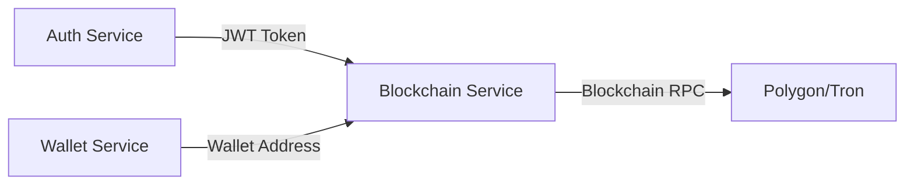

# Blockchain Service - Postman Collection

## Overview

This Postman collection contains comprehensive tests for the Blockchain Service, including success cases, edge cases, authentication tests, and security tests.

## 🔐 **Important: Wallet Ownership & Operations**

### **READ-ONLY Operations** (Current Implementation)
All endpoints in this Postman collection test **READ-ONLY** blockchain operations:
- ✅ Verify wallet existence
- ✅ Get token balances
- ✅ Get transaction details
- ✅ Monitor transfers
- ✅ Network status checks
- ✅ Gas/energy estimation

**These operations DO NOT require wallet ownership or private keys!** They simply query public blockchain data.

### **WRITE Operations** (Future Implementation)
Future endpoints that SEND transactions to blockchain will require:
- ⚠️ Wallet ownership (private key)
- ⚠️ Generated wallets (`createdBySystem = true`)
- ⚠️ User password for decryption

Examples of write operations (not yet implemented):
- Send USDT
- Swap tokens
- Approve token spending

## 📚 **Collection Structure**

### 01 - Service Health & Info
- Health check
- Get supported chains
- Verify service is running

### 02 - Authentication Tests
- Test missing auth token (should fail with 401)
- Test invalid auth token (should fail with 401)
- Verify all blockchain endpoints require authentication

### 03 - Wallet Verification
- Verify Polygon wallets exist on blockchain
- Verify Tron wallets exist on blockchain
- Test invalid chain types
- Test invalid address formats

### 04 - Balance Queries
- Get USDT balance (Polygon & Tron)
- Get custom token balance
- Test invalid addresses

### 05 - Network Status
- Get Polygon network status
- Get Tron network status
- Verify health checks

### 06 - Gas Estimation
- Estimate gas for token transfers
- Estimate gas for native transfers
- Test invalid transaction types

### 07 - Edge Cases & Security
- SQL injection prevention
- XSS attack prevention
- Case sensitivity tests

## 🔧 **Setup Instructions**

### 1. Import Collection
Import `Shield Blockchain Service.postman_collection.json` into Postman.

### 2. Use Shared Environment

**IMPORTANT**: This collection uses the **shared environment** located at:
```
/postman/Shield Platform.postman_environment.json
```

Import this environment file which contains:
- `blockchain_service_url` - http://localhost:3004
- `access_token` - Your JWT token (get from auth-service)
- `wallet_address` - Test wallet address (set after creating/importing wallet)
- All other service URLs

### 3. Get Auth Token

Before running tests, get a valid JWT token:

**Option A: Use Auth Service Collection**
1. Import `/services/auth-service/postman/Shield Auth Service.postman_collection.json`
2. Run "Register User - Success" or "Login User - Success"
3. Token will be automatically saved to `{{access_token}}`

**Option B: Manual Login**
```bash
POST {{auth_service_url}}/auth/login
{
  "email": "test@shield.com",
  "password": "TestPassword123!@#"
}
```
Copy the token from response and set it in environment as `access_token`.

### 4. Create/Import a Wallet

Get a wallet address for testing:

**Option A: Use Wallet Service Collection**
1. Import `/services/wallet-service/postman/Shield Wallet Service.postman_collection.json`
2. Run "Create Wallet - Success" or "Generate Wallet - Success"
3. Copy the wallet address
4. Set it in environment as `wallet_address`

**Option B: Use Public Wallet Addresses**
For testing read-only operations, you can use any public wallet address:
```javascript
// Polygon
"wallet_address": "0x742d35Cc6634C0532925a3b844Bc9e7595f0bEb1"

// Tron  
"wallet_address": "TYASr5UV6HEcXatwdFQfmLVUqQQQMUxHLS"
```

## 📋 **Environment Variables Used**

From the shared environment (`Shield Platform.postman_environment.json`):

| Variable | Description | Example |
|----------|-------------|---------|
| `blockchain_service_url` | Blockchain service URL | http://localhost:3004 |
| `access_token` | JWT authentication token | eyJhbGciOiJIUzI1NiIs... |
| `wallet_address` | Test wallet address | 0x742d35Cc... |
| `auth_service_url` | Auth service URL (for login) | http://localhost:3001 |
| `wallet_service_url` | Wallet service URL (for setup) | http://localhost:3002 |

## ✅ **Running Tests**

### Full Test Run
1. Ensure all services are running:
   ```bash
   # Terminal 1 - Auth Service
   cd services/auth-service && npm run dev
   
   # Terminal 2 - Wallet Service  
   cd services/wallet-service && npm run dev
   
   # Terminal 3 - Blockchain Service
   cd services/blockchain-service && npm run dev
   ```

2. In Postman:
   - Select "Shield Platform - All Services" environment
   - Set `access_token` (from auth-service login)
   - Set `wallet_address` (from wallet-service or use public address)
   - Click "Run" → "Run Shield Blockchain Service"

### Individual Tests
- Select any request
- Ensure environment is selected
- Click "Send"

### Expected Results
- **Authentication tests**: Should fail with 401 without valid token
- **Validation tests**: Should fail with 400 for invalid inputs
- **Success tests**: Depend on blockchain RPC availability
- **Edge cases**: Should be handled gracefully

## 🧪 **Test Coverage**

### ✅ Success Cases (~15 tests)
- All endpoints with valid inputs
- Both Polygon and Tron chains
- Different token addresses
- Various transaction types

### ✅ Error Cases (~10 tests)
- Missing authentication (401)
- Invalid authentication (401)
- Invalid chain names (400)
- Invalid address formats (400)
- Invalid parameters (400)

### ✅ Security Tests (~5 tests)
- SQL injection attempts
- XSS attempts
- Input sanitization
- Case sensitivity

**Total: ~30 test assertions**

## 🔗 **Integration with Other Services**

### Service Dependencies



### Complete Workflow

1. **Setup** (One-time):
   ```bash
   # Register user
   POST {{auth_service_url}}/auth/register
   
   # Login
   POST {{auth_service_url}}/auth/login
   # → Saves {{access_token}}
   
   # Create/import wallet
   POST {{wallet_service_url}}/wallets
   # → Saves {{wallet_address}}
   ```

2. **Blockchain Operations** (With auth & wallet):
   ```bash
   # Verify wallet exists on chain
   GET {{blockchain_service_url}}/blockchain/POLYGON/verify/{{wallet_address}}
   
   # Get balance
   GET {{blockchain_service_url}}/blockchain/POLYGON/balance/{{wallet_address}}
   
   # Check network status
   GET {{blockchain_service_url}}/blockchain/POLYGON/status
   ```

## 🔒 **Security Notes**

### Authentication Required
ALL blockchain endpoints require authentication:
- Health endpoint (/) is public
- All /blockchain/* endpoints require valid JWT
- Token must be in `Authorization: Bearer {{access_token}}` header

### Read-Only Operations
Current endpoints are safe for testing with any wallet address:
- No transactions are signed
- No private keys needed
- No blockchain state changes
- Just querying public data

### Test Data
Safe to use these public addresses for testing:
- **Polygon**: Binance Hot Wallet `0x742d35Cc6634C0532925a3b844Bc9e7595f0bEb1`
- **Tron**: Binance `TYASr5UV6HEcXatwdFQfmLVUqQQQMUxHLS`

These addresses have high activity and are good for testing balance/transaction queries.

## 🐛 **Troubleshooting**

### "Cannot GET /blockchain/..."
**Cause**: Service not running or wrong port  
**Solution**: 
```bash
cd services/blockchain-service
npm run dev
# Should see: ✅ Blockchain Service running on port 3004
```

### "401 Unauthorized" on all requests
**Cause**: Missing or invalid `access_token`  
**Solution**:
1. Run auth-service login request
2. Copy token from response
3. Set in environment as `access_token`
4. Or use Auth Service collection which sets it automatically

### "Environment variable not found"
**Cause**: Wrong environment selected  
**Solution**: 
- Click environment dropdown (top-right)
- Select "Shield Platform - All Services"
- Verify variables exist in "Current Value" column

### "RPC call failed" errors
**Cause**: Blockchain RPC endpoint unavailable  
**Solutions**:
- Check internet connection
- Verify RPC URLs in blockchain-service `.env`
- Public RPCs may have rate limits
- Wait a few seconds and retry

### Tests timing out
**Cause**: Blockchain RPC slow to respond  
**Solution**: 
- Settings → General → Request timeout → Increase to 30000ms
- Use Alchemy/Infura for better reliability

## 📖 **Related Documentation**

- [Blockchain Service README](../README.md) - Service architecture and API docs
- [Wallet Ownership Guide](../../wallet-service/WALLET_OWNERSHIP.md) - Wallet types and capabilities
- [Auth Service Collection](../../auth-service/postman/README.md) - Authentication setup
- [Wallet Service Collection](../../wallet-service/postman/README.md) - Wallet management

## 🎯 **Best Practices**

### When Testing
1. ✅ Always use shared environment
2. ✅ Get fresh auth token for each session
3. ✅ Test both success and error cases
4. ✅ Use real wallet addresses with activity for better tests
5. ✅ Check service logs if tests fail unexpectedly

### When Adding New Tests
1. Follow existing naming conventions
2. Include descriptive test assertions
3. Test both success and failure paths
4. Use shared environment variables
5. Update this README with new categories

## 📞 **Support**

If tests fail unexpectedly:
1. ✅ Check all services are running (`npm run dev`)
2. ✅ Verify environment selected and variables set
3. ✅ Check service logs in terminal
4. ✅ Test health endpoints individually
5. ✅ Verify blockchain RPC status

---

**Note**: This collection uses the shared environment for consistency across all Shield Platform services. Always ensure you're using "Shield Platform - All Services" environment when running tests.
